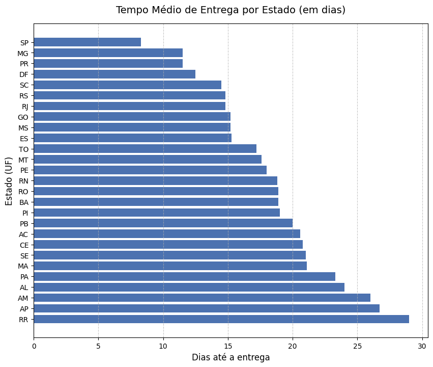
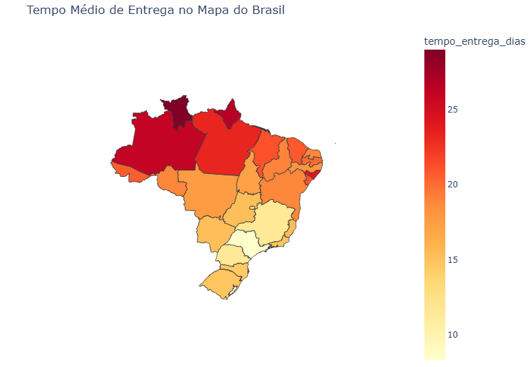
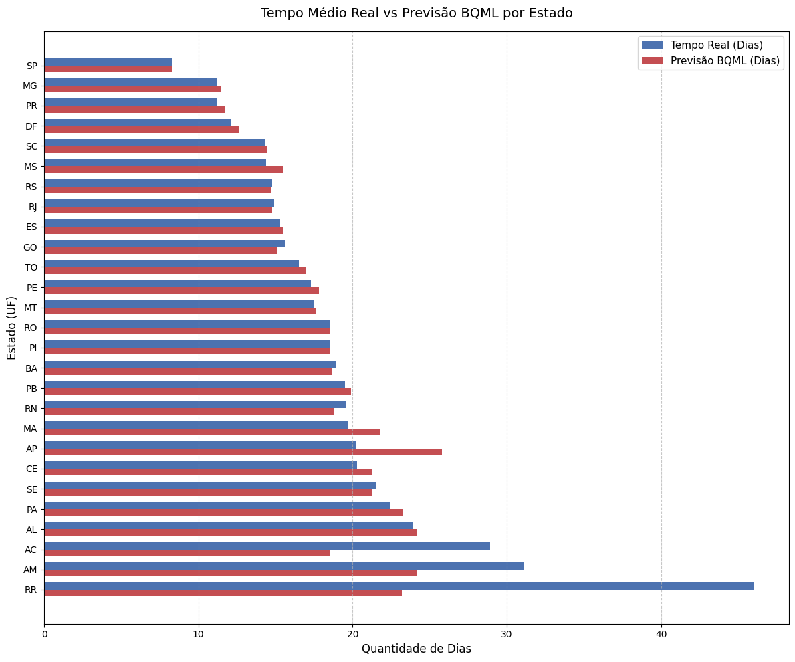
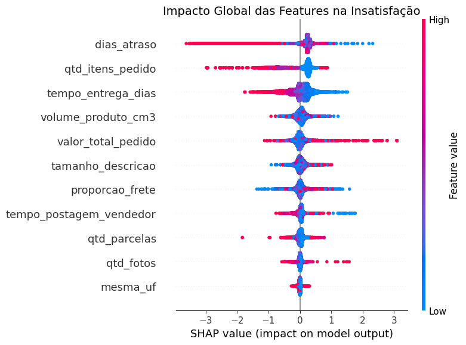
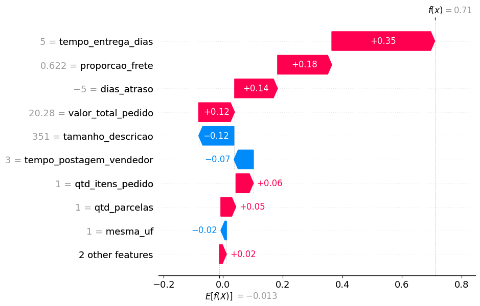

# 📦 Simulador de Satisfação do Cliente - Olist


  
Este repositório conta a história do projeto estruturada em três atos: a análise da logística de entrega, a estimativa de prazos utilizando BigQuery ML e a previsão da satisfação do cliente com um modelo XGBoost. O projeto também conta com uma aplicação interativa que permite ao usuário ajustar os parâmetros da compra e observar, na prática, como cada variável afeta o risco de insatisfação.

🔗 **App no ar:** [Clique aqui para abrir o aplicativo!](https://olist-satisfaction-classifier.streamlit.app/)

| Etapa | Pergunta | Ferramenta | Resultado |
|---|---|---|---|
| **1** | Quanto tempo a entrega leva em cada estado? | Python · Pandas | SP: **8,3 dias** × RR: **29,0 dias** |
| **2** | Dá para prever o prazo só com estado (UF) e mês? | BigQuery ML · Regressão Linear | **R² ~0,24**, **MAE 5,3 dias** |
| **3** | Dá para identificar pedidos com risco de insatisfação? | XGBoost · SHAP | **Recall 57%** · **Precisão 43%** · **Acurácia 72%** |
| **4** | Como explorar o modelo sem programar? | Streamlit | Simulador com cenários e explicação por pedido |
> **Só tem um minuto?** Veja a tabela acima e abra o app.  
> **Quer entender o método?** Siga as Partes 1 a 3.

## 🧭 Sumário

- [🎯 Resumo do projeto](#-resumo-do-projeto-o-que-é-o-que-analisa-e-os-resultados)
- [🎲 Contexto e dados](#-contexto-e-dados)
- [Parte 1 · Prazo de entrega por estado](#parte-1--quanto-tempo-o-pedido-leva-para-chegar-em-cada-estado)
- [Parte 2 · Previsão de prazo com BigQuery ML](#parte-2-bqml--é-possível-prever-quantos-dias-um-pedido-demorará-a-chegar-com-base-na-sua-localização-e-sazonalidade)
- [Parte 3 · Previsão de satisfação com XGBoost](#parte-3-xgboost--como-antecipar-a-insatisfação-do-cliente-antes-mesmo-dele-avaliar-a-compra)
- [🏆 O produto final: simulador em Streamlit](#-o-produto-final-simulador-de-satisfação-streamlit)

## 🎯 Resumo do Projeto: O que é, o que analisa e os resultados

O objetivo principal deste projeto é responder a uma pergunta de grande valor para qualquer loja online: **"É possível saber se um cliente vai ficar insatisfeito com a compra antes mesmo de ele fazer uma reclamação?"**

Para responder a isso, o projeto foi dividido em partes simples e fáceis de entender:

* **1. O que analisamos?**
  Olhamos para o histórico de mais de 100 mil compras reais feitas no Brasil entre 2016 e 2018, através de datasets da Olist. Analisamos cada detalhe da entrega: qual foi o valor do frete, quantos dias a encomenda demorou para chegar, se houve atraso e até o tamanho da descrição do produto. 

* **2. O que descobrimos?**
    Descobrimos que o prazo de entrega varia muito pelo país: por exemplo, um cliente em São Paulo recebe a compra em cerca de 8 dias, enquanto um cliente em Roraima precisa esperar, em média, quase um mês. No modelo de satisfação, os fatores de logística, em especial o atraso, estão entre os que mais pesam na previsão de insatisfação.

* **3. A Inteligência Artificial**
  Em vez de apenas olhar para o passado, criamos um modelo de Inteligência Artificial para estimar o risco de insatisfação.
  > **Exemplo prático:** Imagine um pedido de um produto barato, com frete caro, que chegou com atraso. Logo após a entrega, o modelo sinaliza risco alto de o cliente dar nota 3 ou menos (classificado como insatisfeito).
  > Nos dados de teste, o modelo acerta o sentimento em cerca de 7 de cada 10 pedidos (Acurácia) e identifica 57% dos clientes que ficaram insatisfeitos.

* **4. O Produto Final**
  Para que qualquer pessoa possa utilizar essa inteligência sem precisar saber sobre programação ou matemática, criamos um **Simulador Interativo** (acessível no link acima). Nele, um gestor de atendimento pode simular qualquer venda, por exemplo, criar um cenário de "compra parcelada com 5 dias de atraso" e ver na hora o risco estimado de o cliente ficar insatisfeito.

**O Valor para o Negócio:**
O modelo não substitui o atendimento: ele ajuda a priorizá-lo. Depois que o pedido é entregue e antes de o cliente avaliar, a equipe pode usar a previsão para identificar os pedidos com maior risco de insatisfação e abordá-los primeiro, com uma mensagem de acompanhamento ou um cupom, por exemplo. O modelo encontra 57% dos clientes que ficariam insatisfeitos (recall), mas só cerca de 4 em cada 10 alertas correspondem a clientes realmente insatisfeitos (precisão de 43%). Por isso, as ações devem ser de baixo custo, já que parte dos alertas será falso alarme. O projeto não mede o impacto dessas ações, mas mostra que o risco pode ser estimado com as informações disponíveis logo após a entrega.

**⚠️ Limitações**

- **Uso após a entrega:** tempo de entrega e dias de atraso só existem depois que o pedido chega. O modelo estima o risco depois da entrega e antes da avaliação, não no momento da compra.
- **Desempenho moderado:** Recall de 57% e Precisão de 43%. Serve para priorizar o atendimento, não para decidir sozinho.
- **Correlação, não causalidade:** o modelo aprende padrões dos dados de 2016 a 2018.
- **Base com linhas repetidas por pedido:** um mesmo pedido pode aparecer mais de uma vez (item e pagamento) e a divisão treino/teste foi aleatória, o que pode deixar as métricas um pouco otimistas.
---

## 🎲 Contexto e Dados

Base: [Brazilian E-Commerce Public Dataset by Olist](https://www.kaggle.com/datasets/olistbr/brazilian-ecommerce)  

Este dataset reúne dados anonimizados de aproximadamente 100 mil pedidos realizados no Brasil entre 2016 e 2018 por meio da Olist, uma plataforma de e-commerce que conecta pequenos lojistas a diferentes marketplaces.
Os dados são provenientes de informações comerciais reais, porém foram anonimizados para preservar a privacidade dos envolvidos, informações que poderiam identificar empresas e parceiros presentes nos textos das avaliações foram substituídas por nomes de casas de **Game of Thrones**.  

<details>
<summary> Tabelas utilizadas e esquema do dataset </summary>

### Esquema


No projeto, foram utilizadas 7 tabelas: 
  - `olist_orders_dataset`
  - `olist_customers_dataset`
  - `olist_order_payments_dataset`
  - `olist_order_reviews_dataset`
  - `olist_order_items_dataset`
  - `olist_products_dataset`
  - `olist_sellers_dataset`  

Elas representam dados sobre pedidos, clientes, pagamentos, avaliações, itens, produtos e vendedores.

</details>

---

## Parte 1 · Quanto tempo o pedido leva para chegar em cada estado?

* **Resultado Principal:**
  - O estado de São Paulo (SP) possui a entrega mais rápida, com média de 8,3 dias.
  - No extremo oposto, Roraima (RR) apresenta o maior tempo de espera, com média de 29,0 dias.




* **Interpretação:** A diferença de prazos é grande: a entrega em Roraima leva mais de três vezes o tempo de São Paulo, e o Centro-Oeste apresenta tempos intermediários. Uma hipótese é que os centros de distribuição e a maioria dos vendedores estejam concentrados no Sul e Sudeste, o que acelera e barateia o frete nessas regiões, enquanto os estados do Norte (como RR, AP e AM) e do Nordeste ficam mais distantes desses centros e podem enfrentar desafios de infraestrutura, como o transporte pela bacia amazônica. Os dados mostram o padrão, mas não testam essas causas.


<details>
<summary> Como o tempo de entrega foi calculado </summary>
  
### Código (`scripts/01_analise_logistica.py`)

* **Arquivos e Variáveis:**
  - `olist_orders_dataset` (`order_status`, `order_purchase_timestamp`, `order_delivered_customer_date`)
  - `olist_customers_dataset` (`customer_id`, `customer_state`).
* **Subconjunto Analisado:** Foram considerados apenas os pedidos que possuíam o status `delivered` (entregues).
* **Cálculo Realizado:** O tempo de entrega foi obtido pela subtração da data de compra com a data de entrega efetiva (`dt.days`). Em seguida, os dados foram agrupados por estado (`customer_state`)
calculando-se a média (`mean`) de dias, ordenada de forma crescente.

</details>

---

## Parte 2 (BQML) · É possível prever quantos dias um pedido demorará a chegar com base na sua localização e sazonalidade?
- **Objetivo de Negócio:** Prever a quantidade de dias necessários para a entrega de um pedido, utilizando o estado de destino e a sazonalidade (mês da compra) como variáveis preditoras em um modelo de Machine Learning no BigQuery (BQML).
- **Metodologia:** Os dados históricos foram exportados para o Google Cloud Platform (BigQuery ML). Foi optado pelo treinamento de um modelo de Regressão Linear, adequado para a previsão de variáveis contínuas. A variável `mes_compra` foi convertida em texto (STRING) para garantir que o algoritmo a interpretasse como um fator categórico de sazonalidade via One-Hot Encoding.  

<details>
<summary> Como funciona a regressão linear do BQML? </summary>
  
### **Como funciona o Modelo?**
- O BQML utiliza a Regressão Linear para prever um valor numérico com base em outras informações. Você fornece ao modelo os dados históricos, indicando quais são as variáveis que podem ajudar na previsão (features)
e qual é o valor que você quer prever (label), ele analisa esses dados e encontra uma relação matemática entre as variáveis de entrada e o resultado. Depois de treinado, você fornece novos dados e ele retorna uma previsão numérica.

</details>

#### A metodologia do projeto foi dividida em 4 etapas para criação e avaliação do modelo:

- **Etapa 1 - Dataset de Exportação (`scripts/02_preparacao_dados_bq.py`):**  
A partir do dataset original no Pandas, as colunas de estado de destino e tempo de entrega foram isoladas, e uma nova variável preditora de sazonalidade (mês da compra) foi gerada.
Para garantir o rigor estatístico e evitar que o algoritmo apenas memorize os dados (Overfitting), a base limpa foi dividida aleatoriamente utilizando a biblioteca scikit-learn:

  - 80% dos registros foram destinados ao treinamento do modelo
  - 20% foram isolados exclusivamente para teste  

  Esses subconjuntos foram exportados como arquivos CSV distintos e carregados no BigQuery.

- **Etapa 2 - Treinamento do Modelo (`queries/02_previsao_prazos_bqml.sql`) - _FUNÇÃO CREATE MODEL_:**  
O comando _CREATE MODEL_ instrui o BigQuery a processar os dados históricos e salvar os padrões matemáticos encontrados. O bloco _OPTIONS_ é a configuração principal da IA:

  - _model_type_ define o algoritmo (Regressão Linear, ideal para prever grandezas contínuas como dias)
  - _input_label_cols_ aponta a coluna "gabarito" que o modelo deve aprender a adivinhar
     
  O modelo foi treinado ignorando registros nulos onde a data de entrega não foi preenchida pela transportadora.  
  
- **Etapa 3: Avaliação de Performance (`queries/02_previsao_prazos_bqml.sql`) -  _FUNÇÃO ML.EVALUATE_:**  
A função _ML.EVALUATE_ testa a precisão do modelo comparando suas previsões com a realidade histórica. As métricas cruciais de análise são:

  - `MAE (Erro Médio Absoluto)`, que quantifica a margem de erro na unidade original (dias)
  - `R² (R-quadrado)`, que indica qual a porcentagem da variação do tempo de entrega é diretamente explicada pelas variáveis que fornecemos

  Para garantir que o modelo não memorizou os dados (Overfitting), a função _ML.EVALUATE_ foi executada exclusivamente sobre a base de teste.

  - **Resultado Etapa 3:**
  O modelo obteve um `Erro Médio Absoluto (MAE)` de 5.33 dias e um `R²` de 0.2398.
  Isso indica que a geografia e a sazonalidade explicam cerca de 24% das variações no tempo de entrega, e que a previsão erra, em média, mais de 5 dias.
  É um resultado modesto: serve como **ponto de partida (baseline)** e mostra que localização e sazonalidade, sozinhas, não bastam. Variáveis como origem do vendedor e dimensões do pacote são candidatas a reduzir esse erro, e a Parte 3 passa a utilizá-las, agora para prever a satisfação.  

    ```json
    [{
    "mean_absolute_error": "5.3340601450903442",
    "mean_squared_error": "65.956713010218863",
    "mean_squared_log_error": "0.31213105797074003",
    "median_absolute_error": "3.9446816497247852",
    "r2_score": "0.23986783484599683",
    "explained_variance": "0.24001579696832842"
    }]
    ```
- **Etapa 4: Inferência (`queries/02_previsao_prazos_bqml.sql`) -  _FUNÇÃO ML.PREDICT_:**  
A função _ML.PREDICT_ aplica o modelo treinado a novos dados. Ela aplica os padrões aprendidos a novas transações, gerando automaticamente uma coluna de previsão `predicted_tempo_entrega_dias`, ela foi aplicada sobre a base de teste para prever o prazo de entrega linha a linha. O resultado foi exportado de volta para o ambiente Python, permitindo a plotagem de um gráfico comparativo entre o valor real e a estimativa do BigQuery.

### **Resultado Etapa 4:**  


- **Interpretação:** A comparação por estado (UF) mostra onde o modelo funciona melhor e pior. Nas regiões Sul, Sudeste e Centro-Oeste, as previsões ficaram mais próximas do prazo real. Na região Norte (RR, AM, AC), o modelo subestimou os prazos de forma consistente. Uma hipótese é que nessas áreas pesem fatores que o modelo não enxerga, como a distância até o vendedor e o tipo de transporte (fluvial, por exemplo), mas isso não foi testado aqui. Com apenas estado e mês, o modelo não tem como capturar essas diferenças, exigindo outras features adicionais.
  
---

## Parte 3 (XGBoost) · Como antecipar a insatisfação do cliente antes mesmo dele avaliar a compra?
- **Objetivo de Negócio:** Avaliar simultaneamente múltiplos parâmetros da jornada de compra (como tempo total de entrega, dias de atraso, características do anúncio etc.) para identificar e ranquear quais variáveis mais influenciam a nota de avaliação (1 a 5 estrelas) dada pelo consumidor, direcionando os esforços de melhoria da empresa.  
- **Metodologia:** Foi construído um modelo de Classificação Binária utilizando **XGBoost (Extreme Gradient Boosting)** no Python. O XGBoost foi escolhido por ser um dos algoritmos mais potentes para dados tabulares, lidando muito bem com relações não lineares e dados complexos. A variável alvo (Target) foi criada a partir da nota da avaliação (`review_score`), classificando os pedidos em "Satisfeito" (notas altas) e "Insatisfeito" (notas baixas).

<details>
<summary> Como funciona o XGBoost? </summary>

### **Como funciona o Modelo?**  
Diferente da regressão linear da Parte 2, o XGBoost cria um "conjunto de árvores de decisão". Ele avalia o pedido fazendo diversas perguntas em sequência (ex: "O pedido atrasou?", "O frete foi mais caro que o produto?", "Foram comprados muitos itens?"). 
  - **O que é uma Árvore de Decisão?** Imagine um fluxograma de perguntas e respostas. O modelo avalia o pedido fazendo divisões lógicas sequenciais. A primeira "ramificação" pode ser: *"O pedido atrasou?"*. Se a resposta for sim, ele segue por um caminho; se não, segue por outro. Em seguida, pode perguntar: *"O frete custou mais de 20% do valor do produto?"*. Ele continua fazendo essas perguntas até chegar a uma conclusão, que é a classificação final: Satisfeito ou Insatisfeito.
  - **A Lógica do _Gradient Boosting_:** Ele não cria apenas uma árvore, mas sim centenas delas de forma sequencial. Cada nova árvore é treinada com o objetivo específico de **corrigir os erros** cometidos pelas árvores anteriores. É como uma equipe onde cada novo membro foca exclusivamente em consertar os pontos cegos dos anteriores, resultando em um modelo final de alta precisão.

</details>

#### A metodologia do projeto foi dividida em 4 etapas para criação e avaliação do modelo:

- **Etapa 1: Engenharia de Features e Preparação da Base (`scripts/03_treinamento_xgboost.py`)**  
A Parte 2 evidenciou que a localização e a sazonalidade, sozinhas, não representam todo o cenário. Para suprir essa lacuna e prever o sentimento do cliente com precisão, novas variáveis preditoras foram geradas para capturar as complexidades logísticas e comerciais. A partir dos datasets originais no Pandas, foi realizado o cruzamento de dados (JOIN) para consolidar a jornada de compra em uma única base, as features criadas são:   

  | Categoria | Variável | Descrição |
  | :--- | :--- | :--- |
  | **Logística** | `tempo_entrega_dias` | Total de dias corridos entre a compra e a entrega ao cliente. |
  | | `dias_atraso` | Diferença em dias entre a data de entrega estimada e a data real. |
  | | `tempo_postagem_vendedor` | Tempo que o vendedor levou para despachar o produto após a aprovação da compra. |
  | **Financeira** | `proporcao_frete` | Valor do frete em relação ao valor do item. |
  | | `valor_total_pedido` | Soma do valor dos produtos e do frete. |
  | | `qtd_parcelas` | Número de parcelas escolhidas no momento do pagamento. |
  | **Produto/Anúncio**| `qtd_fotos` | Quantidade de imagens disponibilizadas no anúncio do produto. |
  | | `tamanho_descricao` | Número de caracteres da descrição do produto. |
  | | `volume_produto_cm3` | Volume estimado da embalagem (comprimento × largura × altura). |
  | | `qtd_itens_pedido` | Quantidade total de itens físicos dentro do mesmo pedido. |
  | **Geográfica** | `mesma_uf` | Variável booleana (1 ou 0) indicando se o cliente e o vendedor estão no mesmo estado. |
 
  Para garantir o rigor estatístico e evitar que o algoritmo apenas memorize os dados (Overfitting), a base enriquecida foi dividida aleatoriamente utilizando a biblioteca scikit-learn:
  
    - 80% dos registros foram destinados ao treinamento do modelo  
    - 20% foram isolados exclusivamente para teste  
      
  Esses subconjuntos foram mantidos no ambiente Python (Pandas) para alimentar diretamente o algoritmo XGBoost nas etapas seguintes.

- **Etapa 2: Preparação da Matriz de Preditoras e Variável Alvo (`scripts/03_treinamento_xgboost.py`)**  
  Agora, com as variáveis de engenharia de features criadas, nesta etapa, estruturamos os dados tabulares em duas matrizes distintas para alimentar o algoritmo de Machine Learning de forma supervisionada:  
  - **Matriz de Preditoras ( X ):** Agrupa as 11 variáveis de engenharia de features construídas.
  - **Variável Alvo ( y ):** Isola a coluna `review_score` (nota de avaliação do cliente), atuando como o gabarito que o modelo utilizará para associar o comportamento logístico e estrutural à satisfação final.

  O modelo foi desenhado como um **Classificador Binário**. A coluna original `review_score` (escala de 1 a 5) foi transformada em duas classes: Notas 1, 2 e 3 foram agrupadas como `0` (Insatisfeito) e  Notas 4 e 5 viraram `1` (Satisfeito)   

  > 💡 *Por que essa decisão faz sentido para o negócio?* No contexto de Customer Experience (CX), a diferença prática entre uma nota 1 e 2 é mínima, ambas indicam um atrito severo e um cliente detrator.
  O objetivo da área de atendimento não é prever o número exato de estrelas, mas sim identificar de forma assertiva se a experiência de compra foi frustrante o suficiente para exigir uma ação de mitigação.
    
  Com a matriz de dados estruturada, o modelo `XGBoost Classifier (Binary)` foi treinado e, em seguida, avaliado contra a base de teste (dados inéditos para o algoritmo). O relatório de classificação gerado foi o seguinte:
    ```text
                  precision    recall  f1-score   support
    
               0       0.47      0.57      0.51      5248
               1       0.86      0.80      0.83     17394
    
        accuracy                           0.75     22642
       macro avg       0.66      0.69      0.67     22642
    weighted avg       0.77      0.75      0.76     22642
    
    ROC-AUC Score: 0.7481
    ```
  #### **Interpretação dos Resultados:**
    - **Acurácia (75%):** De forma geral, o modelo acerta o sentimento final do cliente em 3 a cada 4 pedidos.
    - **Identificação de Clientes em Risco (Classe 0):** O modelo possui um *Recall* de 57% para a classe minoritária. Em termos de negócio, a empresa consegue interceptar proativamente quase 60% dos clientes que teriam       uma experiência ruim antes mesmo deles registrarem a reclamação.
    - **ROC-AUC:** A pontuação de ~75% indica uma capacidade sólida de distinguir os padrões lógicos que diferenciam um cliente promotor de um detrator.

- **Etapa 3: Explicabilidade do Modelo com SHAP Values (`scripts/03_treinamento_xgboost.py`)**  
  Modelos baseados em árvores (como o XGBoost) costumam ser vistos como "caixas pretas". Para que o time de negócios confiasse nas previsões, utilizamos a biblioteca **SHAP (Shapley Additive explanations)**, baseada na Teoria dos Jogos, para explicar como cada variável afeta a probabilidade de um cliente ficar insatisfeito.

    - **1. SHAP Summary Plot (Visão Global):**  
      Este gráfico nos mostra quais variáveis mais impactam o modelo de forma geral.
      
        
      > **💡 Insight:** Fica claro que as variáveis logísticas dominam o topo. Um `dias_atraso` alto (pontos vermelhos à direita) empurra a previsão fortemente para a insatisfação (Classe 0).

    - **2. SHAP Waterfall Plot (Visão Individual):**  
      Enquanto o Summary Plot olha para o todo, o Waterfall Plot destrincha **um único pedido**.
      
      _**Nota sobre o gráfico:** O padrão de cores do SHAP pode parecer contraintuitivo à primeira vista. As barras **vermelhas** significam que a variável teve um impacto positivo no valor numérico (empurrando a previsão para cima), enquanto as barras **azuis** indicam que a variável puxou o valor para baixo._
      
        
      > **💡 Como a área de CX usa isso?** O gráfico explica o "porquê" por trás da previsão. Neste exemplo real, o modelo indica que o cliente ficará **Satisfeito**. A logística pesou a favor: o pedido foi entregue em apenas 5 dias (contribuição de +0,35) e chegou 5 dias antes do prazo prometido (`dias_atraso` = -5, +0,14), apesar do frete alto (62,2% do preço do produto).
      > *Os valores do gráfico estão na escala interna do modelo (log-odds), não em pontos percentuais: um resultado final de 0,71 corresponde a cerca de 67% de probabilidade de satisfação.*

- **Etapa 4: Otimização de Hiperparâmetros (Fine-Tuning) - (`scripts/03_treinamento_xgboost.py`)**  
    Após a avaliação inicial e a extração dos insights com o SHAP, realizamos um ajuste fino no "motor" do XGBoost para garantir que o modelo não sofresse de *overfitting* (decorar os dados de treino) e conseguisse generalizar de forma segura em produção.
    Avaliamos diferentes combinações matemáticas utilizando técnicas de busca (`RandomizedSearchCV`), ajustando parâmetros cruciais como `max_depth`, `learning_rate` e `n_estimators`.
    - `max_depth`: Controlando a profundidade máxima das árvores para evitar que o modelo ficasse excessivamente complexo
    - `learning_rate` e `n_estimators`: Balanceando a velocidade de aprendizado e a quantidade de árvores construídas, encontrando o ponto ideal de máxima performance
    
    **Resultado da Otimização:** O *Recall* da classe insatisfeito ficou igual (57%), mas as demais métricas caíram um pouco em relação ao modelo inicial:

    | Modelo | Precisão (insat.) | Recall (insat.) | F1 (insat.) | Acurácia | ROC-AUC |
    |---|---|---|---|---|---|
    | Inicial (parâmetros padrão) | 0,47 | 0,57 | 0,51 | 0,75 | 0,748 |
    | Final (ajustado) | 0,43 | 0,57 | 0,49 | 0,72 | - |

    Como o recall, métrica priorizada na busca, ficou igual nos dois modelos e as demais métricas variaram pouco, o modelo ajustado foi o escolhido para o app, uma vez que a busca não trouxe um ganho claro.
  
  ```text
  Iniciando a busca pela melhor calibração...
  Fitting 3 folds for each of 15 candidates, totalling 45 fits
  
  --- Melhor Configuração Encontrada ---
  {'subsample': 1.0, 'n_estimators': 200, 'max_depth': 3, 'learning_rate': 0.05, 'colsample_bytree': 0.7}
  
  --- Desempenho do Modelo ---
                precision    recall  f1-score   support
  
             0       0.43      0.57      0.49      5248
             1       0.86      0.77      0.81     17394
  
      accuracy                           0.72     22642
     macro avg       0.64      0.67      0.65     22642
  weighted avg       0.76      0.72      0.74     22642
  ```
---

## 🏆 O Produto Final: Simulador de Satisfação (Streamlit)

Para tornar real o valor do modelo e tirá-lo do ambiente de código, uma aplicação web interativa foi criada utilizando o framework **Streamlit**. O objetivo foi criar uma ferramenta em que gestores e analistas de atendimento possam simular cenários e tomar decisões sem precisarem saber programar.


https://github.com/user-attachments/assets/e32f57ec-aaba-4b69-9b82-f5bd2e2470b6


### Como Funciona?:
- O Streamlit atua como a interface visual que consome o modelo XGBoost treinado na Parte 3 (exportado no arquivo `modelo_olist_xgb.json`). A cada ajuste feito pelo usuário nos parâmetros, o aplicativo envia os novos dados para esse "cérebro",
que realiza o cálculo matemático em milissegundos e devolve a probabilidade de insatisfação em tempo real. Isso comprova que é possível integrar Machine Learning preditivo e usabilidade de forma leve e responsiva.

### Principais Funcionalidades da Aplicação:
- **Painel de Simulação (Barra Lateral):** O usuário pode ajustar 11 parâmetros divididos de forma intuitiva em *Logística*, *Pedido* e *Anúncio/Produto*. O modelo atualiza a previsão em tempo real a cada alteração.
- **Cenários Prontos (Presets):** Para facilitar a análise, a aplicação conta com botões de atalho para cenários comuns, como *"Pedido ideal"*, *"Entrega atrasada"*, *"Compra parcelada"* e *"Anúncio fraco"*.
- **Medidor de Risco:** O output principal é um gráfico estilo *gauge* (velocímetro) que converte a probabilidade do modelo num Veredito de Risco de Insatisfação classificado em três níveis:
  - **Baixo** (Verde)
  - **Moderado** (Amarelo)
  - **Alto** (Vermelho)  
  
  Quando o risco é Alto, o sistema sugere automaticamente uma ação preventiva.

- **Explicabilidade Integrada (Abas):** 
  - **Por que essa previsão?:** Gera o gráfico SHAP (Waterfall Plot) para o cenário atual, mostrando os fatores exatos de risco e proteção daquela compra.
  - **Curva de Sensibilidade:** Permite isolar um único parâmetro (ex: dias de atraso) e visualizar como o aumento ou diminuição desse fator afeta a probabilidade de satisfação do cliente.
---
